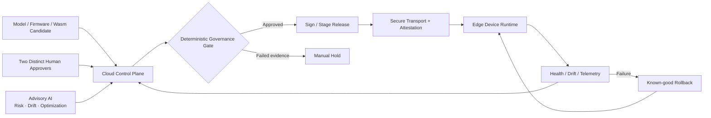
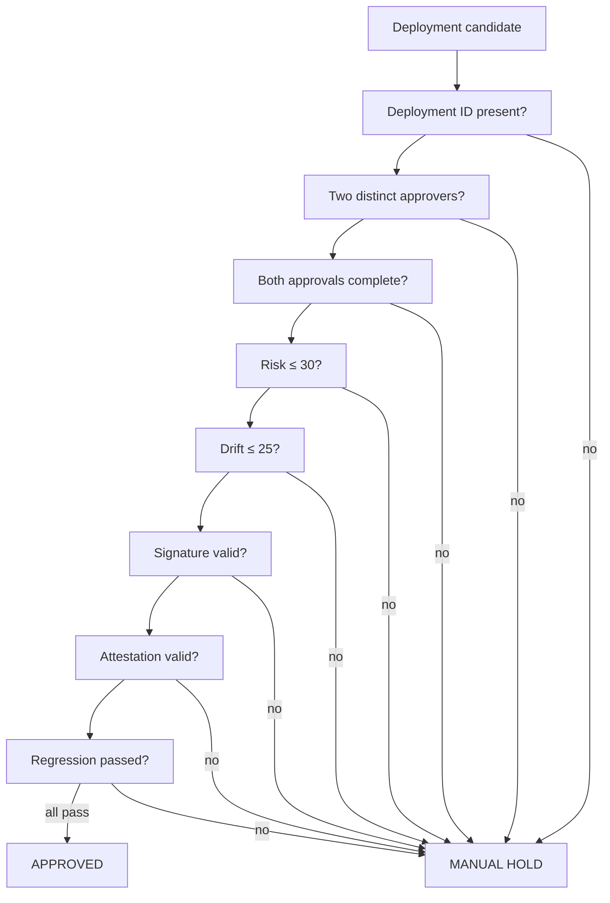

<p align="center">
  
</p>

<h1 align="center">Secure Edge AI Governance Playground</h1>

<p align="center">
  <strong>Advisory AI can recommend. Deterministic policy and accountable humans authorize.</strong><br>
  An executable lifecycle-first governance demonstrator for AI models deployed across distributed edge systems.
</p>

<p align="center">
  <a href="https://github.com/h00w/secure-edge-ai-governance/actions/workflows/ci.yml"></a>
  
  
  
  
  
  
</p>

<p align="center">
  <a href="https://secure-edge-ai-governance.streamlit.app/"><strong>Live Streamlit Demo</strong></a> ·
  <a href="https://secure-edge-ai-governance.hendar2-0.chatgpt.site/"><strong>Web Playground</strong></a> ·
  <a href="docs/ARCHITECTURE.md">Architecture</a> ·
  <a href="docs/SECURITY_MODEL.md">Security Model</a> ·
  <a href="docs/DEMO_GUIDE.md">Demo Guide</a> ·
  <a href="docs/PORTFOLIO.md">Portfolio Proof</a>
</p>

<p align="center">
  <a href="https://secure-edge-ai-governance.streamlit.app/">
    
  </a>
</p>

<p align="center">
  <em>Secure deployment governance for real-world Edge AI: evidence, attestation, human approval, deterministic release gates, and safe recovery.</em>
</p>

<p align="center">
  <a href="https://secure-edge-ai-governance.streamlit.app/"></a>
</p>

---

## Why this project exists

Edge AI governance is often expressed as diagrams, policy documents, and compliance checklists. Those artifacts matter, but they do not prove that a release decision is actually enforced.

This repository turns the central governance rule into executable software. A deployment is approved only when **identity, two-person approval, risk, drift, signature, attestation, and regression evidence all satisfy deterministic policy**. Any missing or failed control produces `manual_hold`.

The project intentionally separates:

- **probabilistic AI advice** from release authority;
- **human accountability** from automated scoring;
- **evidence collection** from policy evaluation; and
- **demo claims** from production security capabilities.

## Architecture at a glance



### Canonical release gate



## What is implemented

| Capability | Implementation | Evidence |
| --- | --- | --- |
| Deterministic deployment gate | `lib/policy.ts` | explicit approve/manual-hold decision |
| Two-person separation of duties | policy + UI + MCP | duplicate identities rejected |
| Risk and drift thresholds | policy | risk ≤ 30, drift ≤ 25 |
| Signature evidence gate | policy | invalid evidence blocks release |
| Attestation evidence gate | policy | invalid evidence blocks release |
| Regression qualification gate | policy | failed regression blocks release |
| Interactive governance simulator | TypeScript/React application | reviewer scenarios |
| Agent/tool integration surface | `/api/mcp` | JSON-RPC governance tools |
| Portable reviewer demo | `demos/streamlit/` | public Streamlit deployment |
| Reproducible verification | GitHub Actions | Node and Python CI jobs |

## Live demos

Two complementary surfaces make the project easy to inspect and independently verify.

### 1. Streamlit governance demo

**Live:** https://secure-edge-ai-governance.streamlit.app/

The Streamlit surface is the fastest way for a reviewer to exercise the deterministic governance gate without installing anything. It exposes deployment identity, risk and drift scores, signature state, attestation state, regression qualification, two distinct approvers, and the resulting approve/manual-hold decision.

Recommended reviewer tests:

- keep all evidence valid → `approved`;
- set risk to 31 → `manual_hold`;
- set drift to 26 → `manual_hold`;
- invalidate signature → `manual_hold`;
- invalidate attestation → `manual_hold`;
- fail regression → `manual_hold`;
- reuse the same approver identity → `manual_hold`;
- remove one approval → `manual_hold`.

### 2. Rich web governance playground

**Live:** https://secure-edge-ai-governance.hendar2-0.chatgpt.site/

The richer web application demonstrates the governance concept as an interactive product surface and exposes the MCP-oriented endpoint used for agent/tool integration experiments.

## Reviewer scenarios

| Scenario | Input change | Expected result |
| --- | --- | --- |
| Valid release | all evidence valid + distinct approvals | `approved` |
| Elevated risk | risk = 31 | `manual_hold` |
| Excess drift | drift = 26 | `manual_hold` |
| Invalid signature | signature = false | `manual_hold` |
| Failed attestation | attestation = false | `manual_hold` |
| Regression failure | regression = false | `manual_hold` |
| Separation-of-duties failure | same approver identity twice | `manual_hold` |
| Incomplete approval | either approval missing | `manual_hold` |

These scenarios are intentionally easy for a recruiter, engineer, security reviewer, or prospective client to reproduce.

## MCP governance tools

The application exposes an MCP-oriented JSON-RPC endpoint at:

```text
/api/mcp
```

Available tools:

| Tool | Purpose |
| --- | --- |
| `request_two_person_approval` | validate a deployment ID and two distinct approver identities |
| `evaluate_deployment_gate` | apply the deterministic fail-closed governance rule |
| `place_manual_hold` | create an explicit hold record with a reason and human next action |

The endpoint demonstrates an important agentic-AI design rule: **an agent may call governance tools, but it cannot override the policy encoded inside them.**

## Repository map

```text
secure-edge-ai-governance/
│
├── app/
│   ├── page.tsx                    # Interactive governance playground
│   └── api/mcp/route.ts            # MCP / JSON-RPC tool surface
│
├── lib/
│   └── policy.ts                   # Canonical TypeScript governance gate
│
├── components/                     # UI component system
├── tests/                          # Web build/render/UI verification
│
├── demos/
│   └── streamlit/
│       ├── app.py                  # Portable governance demo
│       ├── policy.py               # Python mirror of gate semantics
│       ├── test_policy.py          # Independent regression tests
│       └── requirements.txt
│
├── docs/
│   ├── ARCHITECTURE.md             # Lifecycle architecture
│   ├── SECURITY_MODEL.md           # Threat and trust model
│   ├── DEMO_GUIDE.md               # Deployment and acceptance tests
│   └── PORTFOLIO.md                # Recruiter-facing proof text
│
├── governance.agentflow            # Declarative governance/agent design
├── edgeai.png                      # Portfolio / showcase cover
└── .github/workflows/ci.yml        # Web + Streamlit CI
```

## Run the primary application

Requirements: Node.js 22.13+ and npm.

```bash
git clone https://github.com/h00w/secure-edge-ai-governance.git
cd secure-edge-ai-governance
npm ci
npm run dev
```

Validate:

```bash
npm run lint
npm test
```

## Run the Streamlit demo locally

```bash
cd demos/streamlit
python -m venv .venv
```

Windows PowerShell:

```powershell
.\.venv\Scripts\Activate.ps1
python -m pip install -r requirements.txt
python -m pytest -q
python -m streamlit run app.py
```

The local application opens at `http://localhost:8501` by default.

## Test the MCP endpoint

Initialize:

```bash
curl -X POST http://localhost:5173/api/mcp \
  -H "Content-Type: application/json" \
  -H "Accept: application/json, text/event-stream" \
  -d '{
    "jsonrpc":"2.0",
    "id":1,
    "method":"initialize",
    "params":{"protocolVersion":"2025-06-18","capabilities":{},"clientInfo":{"name":"curl-demo","version":"1.0"}}
  }'
```

List tools:

```bash
curl -X POST http://localhost:5173/api/mcp \
  -H "Content-Type: application/json" \
  -d '{"jsonrpc":"2.0","id":2,"method":"tools/list","params":{}}'
```

## CI and verification

GitHub Actions validates two independent surfaces:

**Web application**

```text
npm ci
npm run lint
npm test
```

**Streamlit governance policy**

```text
python -m pip install -r demos/streamlit/requirements.txt
python -m pytest -q
```

This separation makes the core policy independently testable across the TypeScript product surface and the portable Python reviewer demo.

## Security model

The public demonstrator models important governance concepts but does not falsely represent production infrastructure as complete.

Implemented as executable controls:

- deterministic fail-closed gate;
- two-person approval semantics;
- risk/drift limits;
- signature/attestation/regression evidence checks; and
- explicit hold reasons.

Not simulated as real production capabilities:

- identity-provider authorization;
- TPM/TEE quote verification;
- HSM/KMS release signing;
- real mTLS certificate lifecycle;
- durable append-only audit storage;
- actual OTA fleet rollout; and
- production rollback execution.

See [Security & Trust Model](docs/SECURITY_MODEL.md) for the complete hardening path.

## Portfolio proof

The project demonstrates a complete engineering chain:

**Architecture → Policy → Interactive UI → Agent Tool Surface → Tests → CI → Documentation → Live Demo**

A concise proof statement:

> Built an executable Secure Edge AI governance demonstrator that separates probabilistic AI advice from deterministic release authority. The system enforces two-person approval, explicit risk/drift thresholds, signature, attestation, and regression evidence, with fail-closed `manual_hold` behavior and an MCP tool surface for agent integration.

### Proof surfaces

- **Streamlit live demo:** https://secure-edge-ai-governance.streamlit.app/
- **Rich web playground:** https://secure-edge-ai-governance.hendar2-0.chatgpt.site/
- **Architecture:** [docs/ARCHITECTURE.md](docs/ARCHITECTURE.md)
- **Security model:** [docs/SECURITY_MODEL.md](docs/SECURITY_MODEL.md)
- **Demo guide:** [docs/DEMO_GUIDE.md](docs/DEMO_GUIDE.md)
- **Portfolio proof:** [docs/PORTFOLIO.md](docs/PORTFOLIO.md)
- **CI:** [GitHub Actions](https://github.com/h00w/secure-edge-ai-governance/actions/workflows/ci.yml)

## Author

**Hendarmawan, PhD Eng.**  
Secure Edge AI · Production AI · AI Governance · Trusted Computing · AI Infrastructure

[LinkedIn](https://www.linkedin.com/in/hender/) · [GitHub](https://github.com/h00w) · [LIFE-AI](https://www.life-ai.se/) · [Streamlit Demo](https://secure-edge-ai-governance.streamlit.app/) · [Web Playground](https://secure-edge-ai-governance.hendar2-0.chatgpt.site/)

---

<p align="center">
  <strong>Production Edge AI needs more than a model deployment.</strong><br>
  It needs evidence, explicit authority, deterministic gates, observability, and a known-good recovery path.
</p>
