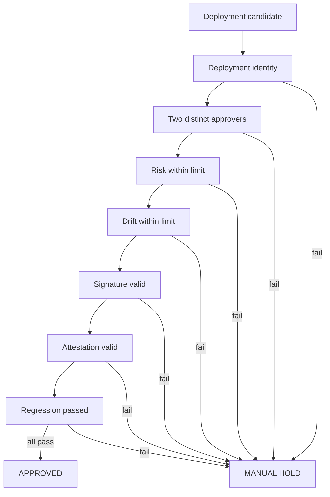
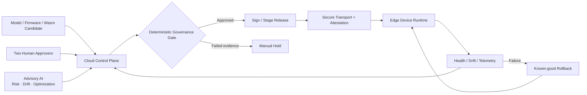

<p align="center">
  <a href="https://secure-edge-ai-governance.streamlit.app/">
    
  </a>
</p>

<h1 align="center">Secure Edge AI Governance</h1>

<p align="center">
  <strong>Governed AI Release Control</strong><br>
  Executable fail-closed governance for Edge AI releases with two-person approval, risk and drift gates, attestation evidence, regression qualification and MCP tooling.
</p>

<p align="center">
  <a href="https://secure-edge-ai-governance.streamlit.app/"><strong>Live Demo ↗</strong></a> ·
  <a href="docs/ARCHITECTURE.md"><strong>Architecture</strong></a> ·
  <a href="docs/SECURITY_MODEL.md"><strong>Security Model</strong></a> ·
  <a href="docs/DEMO_GUIDE.md"><strong>Demo Guide</strong></a>
</p>

<p align="center">
  <a href="https://github.com/h00w/secure-edge-ai-governance/actions/workflows/ci.yml"></a>
  
  
  
  
</p>

---

## Why this project exists

Edge AI governance is often documented as policy, diagrams, or compliance checklists. Those artifacts matter, but they do not prove that a release decision is actually enforced.

This project turns governance into executable software. A candidate release is approved only when **deployment identity, two distinct human approvals, risk, drift, signature, attestation, and regression evidence** satisfy deterministic policy. Any missing or failed control produces `manual_hold`.

> **Advisory AI can recommend. Deterministic policy and accountable humans authorize.**

## Core engineering principle

The system deliberately separates:

- probabilistic AI advice from release authority;
- human accountability from automated scoring;
- evidence collection from policy evaluation;
- model quality from device trust; and
- demo claims from production security capabilities.

The objective is not simply to predict whether a release is safe. The objective is to make the release decision **inspectable, testable, fail-closed, and reproducible**.

## Release gate



## Architecture



## What is implemented

| Capability | Implementation | Release evidence |
| --- | --- | --- |
| Deterministic release gate | `lib/policy.ts` | explicit approve/manual-hold result |
| Separation of duties | policy + UI + MCP | duplicate approver identities rejected |
| Risk and drift gates | deterministic thresholds | out-of-policy values block release |
| Signature check | release policy | invalid signature blocks release |
| Attestation check | release policy | invalid evidence blocks release |
| Regression gate | qualification policy | failed regression blocks release |
| Governance simulator | web application | reproducible reviewer scenarios |
| MCP tool surface | `/api/mcp` | bounded governance actions |
| Streamlit reviewer demo | `demos/streamlit/` | portable public proof |
| CI | GitHub Actions | repeatable TypeScript + Python verification |

## Verify it in two minutes

1. Open the [live Streamlit demo](https://secure-edge-ai-governance.streamlit.app/).
2. Keep all evidence valid and use two distinct approvers → `approved`.
3. Change risk above the threshold, invalidate attestation, fail regression, reuse one approver identity, or remove an approval → `manual_hold`.
4. Inspect `lib/policy.ts` and `demos/streamlit/policy.py` to see the policy implemented independently in TypeScript and Python.
5. Check GitHub Actions for repeatable verification.

## MCP governance tools

The `/api/mcp` JSON-RPC surface exposes bounded governance operations:

| Tool | Purpose |
| --- | --- |
| `request_two_person_approval` | validate deployment identity and approver separation |
| `evaluate_deployment_gate` | execute the fail-closed release policy |
| `place_manual_hold` | create an explicit hold with reason and next action |

An AI agent may call these tools, but it cannot override the deterministic policy implemented inside them.

## Security boundary

Implemented as executable controls:

- deterministic fail-closed decision logic;
- two-person approval semantics;
- risk and drift limits;
- signature, attestation, and regression evidence checks;
- explicit hold reasons; and
- independent CI verification.

Not represented as completed production infrastructure:

- identity-provider authorization;
- hardware-backed TPM/TEE quote verification;
- HSM/KMS production release signing;
- production mTLS lifecycle;
- append-only audit storage;
- real OTA fleet orchestration; and
- production rollback execution.

See [`docs/SECURITY_MODEL.md`](docs/SECURITY_MODEL.md) for the hardening path.

## Run locally

```bash
git clone https://github.com/h00w/secure-edge-ai-governance.git
cd secure-edge-ai-governance
npm ci
npm run lint
npm test
npm run dev
```

Streamlit reviewer demo:

```bash
cd demos/streamlit
python -m pip install -r requirements.txt
python -m pytest -q
python -m streamlit run app.py
```

## Proof chain

**Architecture → Policy → Interactive UI → MCP Tool Surface → Tests → CI → Documentation → Live Demo**

- Live demo: https://secure-edge-ai-governance.streamlit.app/
- Architecture: [`docs/ARCHITECTURE.md`](docs/ARCHITECTURE.md)
- Security model: [`docs/SECURITY_MODEL.md`](docs/SECURITY_MODEL.md)
- Demo guide: [`docs/DEMO_GUIDE.md`](docs/DEMO_GUIDE.md)

## Author

**Hendarmawan, PhD Eng.**  
AI Engineering · Secure Edge AI · Trusted Computing · AI Governance · Production AI

[Website](https://hendarmawan.se) · [LinkedIn](https://www.linkedin.com/in/hender/) · [GitHub](https://github.com/h00w)


## Production AI proof level

This repository uses the shared **Production AI Five-Level Proof Model v1**:

`L1 Runnable → L2 Reproducible → L3 Capability-Validated → L4 Production-Candidate → L5 Production-Validated`.

Run `make proof` to generate the machine-readable assessment. The repository deliberately caps its current claim at **L3 — Capability-Validated**; the public reviewer surface and deterministic policy tests are evidence of capability, not proof of hardware-backed or fleet-production deployment.

See [PROOF_MODEL.md](PROOF_MODEL.md) and [REPRODUCIBILITY.md](REPRODUCIBILITY.md).
