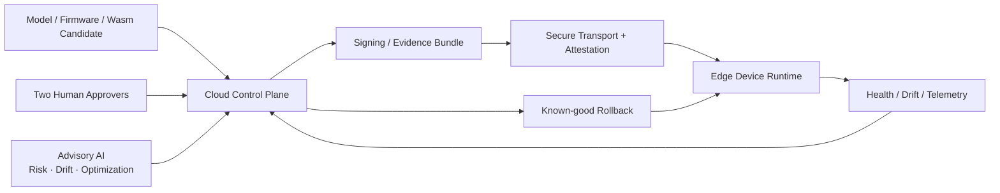
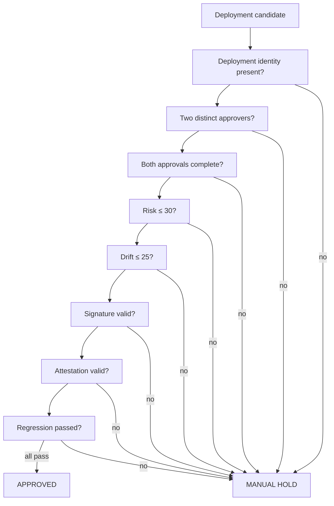
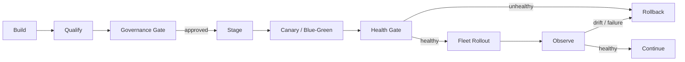

# Secure Edge AI Governance Architecture

The repository turns a lifecycle-first Edge AI governance design into executable release controls, an interactive web surface, and an MCP tool endpoint.

The central design principle is simple:

> **Advisory AI may recommend. Deterministic policy evaluates evidence. Distinct humans authorize consequential release decisions.**

## System context



## Release decision path



The rule is intentionally deterministic and fail-closed. Advisory AI can supply a score or recommendation but cannot remove mandatory evidence or authorize a release.

## Repository architecture

```text
secure-edge-ai-governance/
│
├── app/
│   ├── page.tsx                 # Interactive governance playground
│   └── api/mcp/route.ts         # JSON-RPC / MCP tool endpoint
│
├── lib/
│   └── policy.ts                # Canonical TypeScript deployment gate
│
├── components/                  # Reusable UI primitives
├── tests/                       # Build/render/UI verification
├── demos/streamlit/             # Portable reviewer demo of gate policy
│
├── docs/
│   ├── ARCHITECTURE.md          # This document
│   ├── SECURITY_MODEL.md        # Trust boundaries and hardening
│   ├── DEMO_GUIDE.md            # Local/live verification procedure
│   └── PORTFOLIO.md             # Recruiter-facing proof description
│
├── governance.agentflow         # Declarative governance/agent design
└── .github/workflows/ci.yml     # Reproducible CI checks
```

## Trust boundaries

| Boundary | Authority | Evidence represented | Failure behavior |
| --- | --- | --- | --- |
| Human governance | release approval | distinct approver identities and decisions | manual hold |
| Cloud control plane | deterministic policy and release orchestration | gate decision, policy version, evidence state | stop release |
| Advisory AI | risk/drift/optimization recommendations | scores and recommendations | advisory flag only |
| Secure transport | peer/channel validation | certificate and attestation result | refuse / hold |
| Device runtime | activation and health state | activation, health, rollback telemetry | known-good rollback |

## Canonical gate contract

The TypeScript policy in `lib/policy.ts` approves only when all conditions are true:

1. deployment identity is present;
2. two non-empty approver identities are present;
3. the approver identities are distinct;
4. both approvers explicitly approve;
5. risk score is at most 30;
6. drift score is at most 25;
7. bundle signature evidence is valid;
8. device attestation evidence is valid; and
9. regression qualification passed.

The output is either:

- `approved`; or
- `manual_hold` with explicit reasons.

## MCP tool surface

`app/api/mcp/route.ts` exposes three governance-oriented tools:

| Tool | Purpose |
| --- | --- |
| `request_two_person_approval` | validate deployment ID and two distinct approver identities |
| `evaluate_deployment_gate` | apply the deterministic release policy |
| `place_manual_hold` | return an explicit hold record and next action |

This surface is intended for agent/tool integration experiments. The agent can call governance functions, but the endpoint does not grant the model authority to bypass the deterministic policy.

## Streamlit reviewer surface

`demos/streamlit/` contains a small portable implementation of the same gate semantics. It exists so a reviewer can deploy the governance rule to Streamlit Community Cloud without depending on the richer TypeScript application stack.

The Streamlit demo intentionally uses no API key and no real customer/device data.

## Evidence and observability

A production version should represent each release decision as a canonical evidence envelope containing at least:

```text
deployment identity
artifact identity / digest
model + firmware version
policy version
risk / drift evidence
signature evidence
attestation evidence
qualification evidence
approver identities + decisions
evaluation timestamp
decision + hold reasons
```

The current demonstrator exposes decision reasons and policy version but does not claim durable or cryptographically signed audit storage.

## Deployment lifecycle



The public repository focuses on the governance gate; staging, secure OTA, fleet rollout, and rollback are architectural lifecycle elements rather than fully implemented fleet-management functions.

## Demo versus production

The project is an educational and portfolio demonstrator, not a production authorization service. It does not simulate missing infrastructure as if it were real.

A production implementation needs:

- OIDC/OAuth and role/separation-of-duty enforcement;
- durable approval and release state;
- replay protection and idempotency keys;
- canonical signed evidence;
- HSM/KMS-backed signing;
- real TPM/TEE attestation verification;
- certificate lifecycle and mTLS enforcement;
- append-only/transparency-log audit storage;
- staged rollout and automated known-good rollback;
- monitoring, tracing, alerts, and security tests; and
- independent threat modeling and compliance review.

See [SECURITY_MODEL.md](SECURITY_MODEL.md) for the detailed trust and hardening model and [DEMO_GUIDE.md](DEMO_GUIDE.md) for reviewer validation steps.
