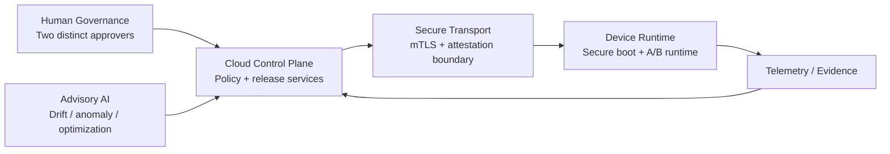

# Security & Trust Model

## Security objective

Prevent an AI-assisted Edge AI release from becoming authorized solely because a probabilistic model recommends it. Release authority remains with deterministic policy plus explicit human governance and verifiable evidence.

## Trust boundaries

| Boundary | Trusted for | Not trusted for | Fail behavior |
| --- | --- | --- | --- |
| Human governance | explicit approval identities and decisions | technical evidence generation | `manual_hold` if incomplete |
| Deterministic policy | threshold and evidence evaluation | human identity proof | fail closed |
| Advisory AI | recommendations, anomaly/drift signals | authorization | advisory only |
| Transport/attestation layer | peer/channel and measured-state evidence | business authorization | refuse/hold |
| Device runtime | activation/health/rollback telemetry | changing governance policy | restore/hold |

## Deterministic release rule

A release is approved only if all of the following are true:

- deployment identity is present;
- two non-empty and distinct approver identities are present;
- both approvers explicitly approve;
- risk score is at most 30;
- drift score is at most 25;
- bundle signature evidence is valid;
- device attestation evidence is valid; and
- regression qualification passed.

Any missing or failed condition produces `manual_hold`.

## Threats represented by the demonstrator

| Threat | Control represented |
| --- | --- |
| AI recommendation bypasses governance | AI is advisory; deterministic policy decides |
| Single-person release authority | two distinct approvers required |
| Unsigned/tampered bundle | signature-validity gate |
| Untrusted device state | attestation-validity gate |
| Model regression | qualification gate |
| Excess model drift | drift threshold |
| Excess release risk | risk threshold |
| Missing evidence | fail-closed manual hold |

## Production controls not simulated

The repository intentionally does **not** pretend the following controls are implemented:

- real identity-provider authentication or authorization;
- TPM/TEE quote verification and endorsement-chain validation;
- HSM/KMS-backed release signing;
- certificate issuance, rotation, and mTLS enforcement;
- append-only audit storage or transparency logs;
- replay prevention and idempotency across distributed release services;
- secure OTA transport and real A/B partition activation;
- SIEM/SOC integrations;
- regulatory compliance certification.

Those capabilities belong in a production implementation and require infrastructure, credentials, hardware, and independent validation beyond a public portfolio demonstrator.

## Production hardening path

1. Add OIDC/OAuth authentication and RBAC/ABAC.
2. Persist approval state in a durable transactional store.
3. Replace booleans with canonical signed evidence envelopes.
4. Integrate a real attestation verifier.
5. Move release signing to HSM/KMS-backed keys.
6. Add nonce/replay protection and idempotency keys.
7. Write audit events to append-only storage.
8. Add deployment health gates and automatic known-good rollback.
9. Add rate limiting, structured logging, metrics, tracing, and alerting.
10. Perform independent threat modeling, penetration testing, and compliance review.
